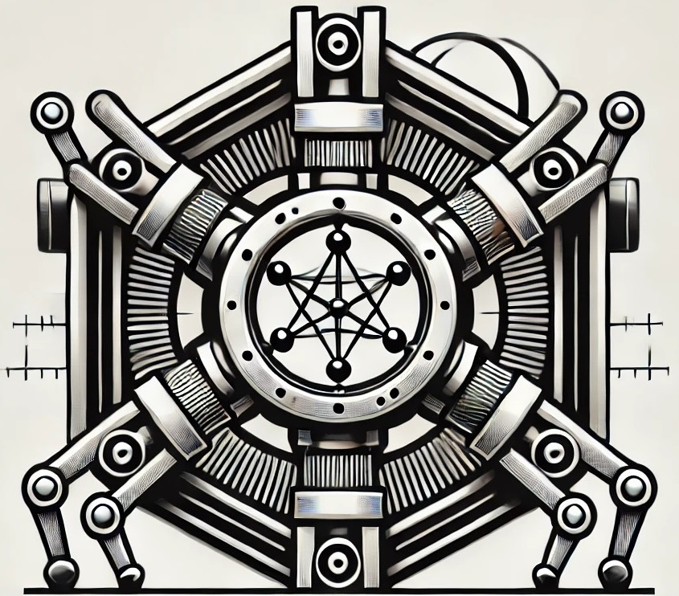

  

# X-Ray Diffractometer for Crystal Characterization

This framework controls the custom build X-Ray Diffractometer (XRD) of the Mechatronics, Robotics and Operations Section.
X-Ray diffraction is used to characterize crystal collimators in terms of bending, miscut and torsion angles.

## Table of Contents

- [Introduction](#x-Ray-Diffractometer-for-Crystal-Characterization)
- [Table of Contents](#table-of-contents)
- [Measurement Setup](#measurement-setup)
- [Repository Structure](#repository-structure)
- [License](#license)
- [API Documentation](#api-documentation)
- [Contributing](#contributing)
- [Contact](#contact)

## Measurement Setup
The devices used in this measurements are:

1. Hexapod robot;
2. n. 8 stepper motors;
3. X-Ray Source;
4. X-Ray Detector;
5. Autocollimator;
6. Monochromator;
7. Slit.

## Repository Structure

The repository is structured in the following way:

1. **ConfigurationFiles**: This directory stores configuration files used to set up or customize various aspects of the x-ray machine.
3. **cmake**: This directory contains CMake build scripts used for building the project with CMake.
4. **extern**: External dependencies or libraries used by the project are stored in this directory. These dependencies may include third-party libraries or other resources required for building and running the project.
5. **modules**: This directory contains modular components that extend the functionality of the framework. Each module may be organized into its own subdirectory within this directory.
6. **scripts**: Various scripts used for automation, testing, or other purposes are stored in this directory. These scripts may include shell scripts, Python scripts, or other types of executable scripts.

## License

This software is released under a CERN proprietary software license. Any permission to use it shall be granted in writing. Requests shall be addressed to CERN through mail-KT@cern.ch.

## API Documentation

The detailed API documentation for each function can be found in the following website: https://mro-dev.web.cern.ch/ci/mro/mechatronics/XRay_Machine

## Contributing

Contributions to this project are welcome. To contribute, please follow the standard GitHub workflow of fork, branch, commit, and pull request.

## Contact

For any questions or inquiries, please contact Gianmarco Ricci at gianmarco.ricci@cern.ch.

