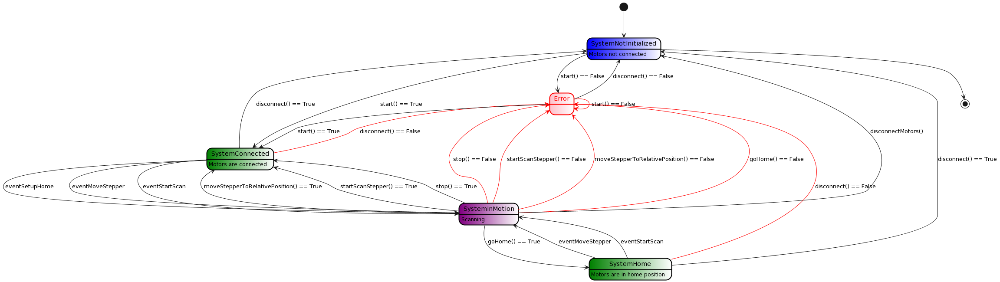

# Devices Module

This module is used to control at high level all stepper motor axes and hexapod robot with the use of finite state machines.
The FSMs have been implemented with the use of "SML (State Machine Language)" library (<https://github.com/boost-ext/sml>).

## States and Transitions

- **SystemNotInitialized**: Represents the initial state where motors are not connected. Transitions to SystemConnected if `start()` is successful, otherwise transitions to Error.

- **SystemConnected**: Indicates that motors are connected. Transitions to SystemInMotion on events such as `eventSetupHome`, `eventMoveStepper`, and `eventStartScan`. Can transition back to SystemNotInitialized if disconnected or to Error in case of errors.

- **SystemInMotion**: Represents the motion process. Transitions to SystemHome if `goHome()` is successful, otherwise transitions to Error. Also transitions to SystemConnected on successful actions like `moveStepperToRelativePosition()` and `startScanStepper()`. Can go back to SystemNotInitialized, and can transition to Error on errors or SystemConnected to stop the motion.

- **SystemHome**: Motors are in the home position. Similar transitions as SystemInMotion, and can transition back to SystemNotInitialized on disconnection.

- **Error**: Represents an error state. Can transition to SystemConnected if recovery is successful, otherwise can stay in the error state.

## Actions and Conditions

- `start()`: Initiates the system and transitions to SystemConnected if successful.

- `disconnect()`: Disconnects the motors. Transitions to SystemNotInitialized if successful, otherwise to Error.

- `eventSetupHome`: Event to set up the home position, transitioning to SystemInMotion.

- `eventMoveStepper`: Event to move the stepper motor, transitioning to SystemInMotion.

- `eventStartScan`: Event to start the scanning process, transitioning to SystemInMotion.

- `goHome()`: Action to move motors to the home position, transitioning to SystemHome if successful, otherwise to Error.

- `moveStepperToRelativePosition()`: Action to move the stepper motor to a relative position, transitioning to SystemConnected if successful, otherwise to Error.

- `startScanStepper()`: Action to start the scanning process on the stepper motor, transitioning to SystemConnected if successful, otherwise to Error.

- `disconnectMotors()`: Action to disconnect motors during scanning, transitioning to SystemNotInitialized.

- `stop()`: Action to stop the scanning process, transitioning to SystemConnected if successful, otherwise to Error.

## Interfaces
The interfaces of which the module is composed are:
1. "ICrystalDeviceController": interface used to control the movement of the crystal;
2. "IMultiStepperDeviceController": interface used to control all the devices with two degrees of freedom (slit and monochromator);
3. "ISingleStepperDeviceController": interface used to control all the devices with one degree of freedom (X-Ray source, X-Ray detector and autocollimator).

## License

This software is released under a CERN proprietary software license. Any permission to use it shall be granted in writing. Requests shall be addressed to CERN through mail-KT@cern.ch.

## API Documentation

The detailed API documentation for each function can be found in the following website: https://mro-dev.web.cern.ch/ci/mro/mechatronics/XRay_Machine

## Contributing

Contributions to this project are welcome. To contribute, please follow the standard GitHub workflow of fork, branch, commit, and pull request.

## Contact

For any questions or inquiries, please contact Gianmarco Ricci at gianmarco.ricci@cern.ch.